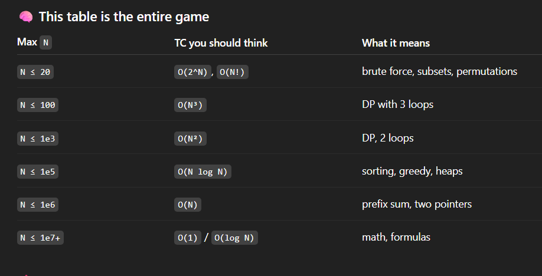
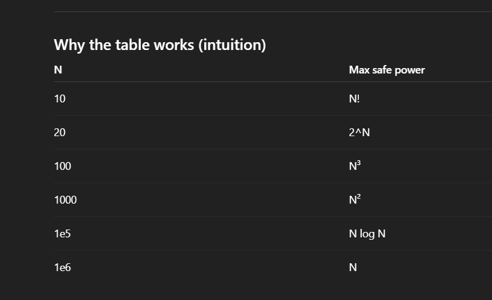

```
    ~10^8 operations ~ 1second (not exact but good enough)
    
    


    if N=1000
    CASE 1:O(N)
    => Operations ≈ 1000

    CASE 2:O(N log N)
    => 1000* log2(1000) = 1000*10 = 10,000

    CASE:3 O(N^2)
    => 1000*1000 = 10^6

    CASE:3 O(N^3)
    => 1000*1000*1000 = 10^9


    mtlb overall operations 10^8 se jyda nhi jane chaiye

    Worst-case total operations ≈ 10⁸ se zyada nahi honi chahiye

